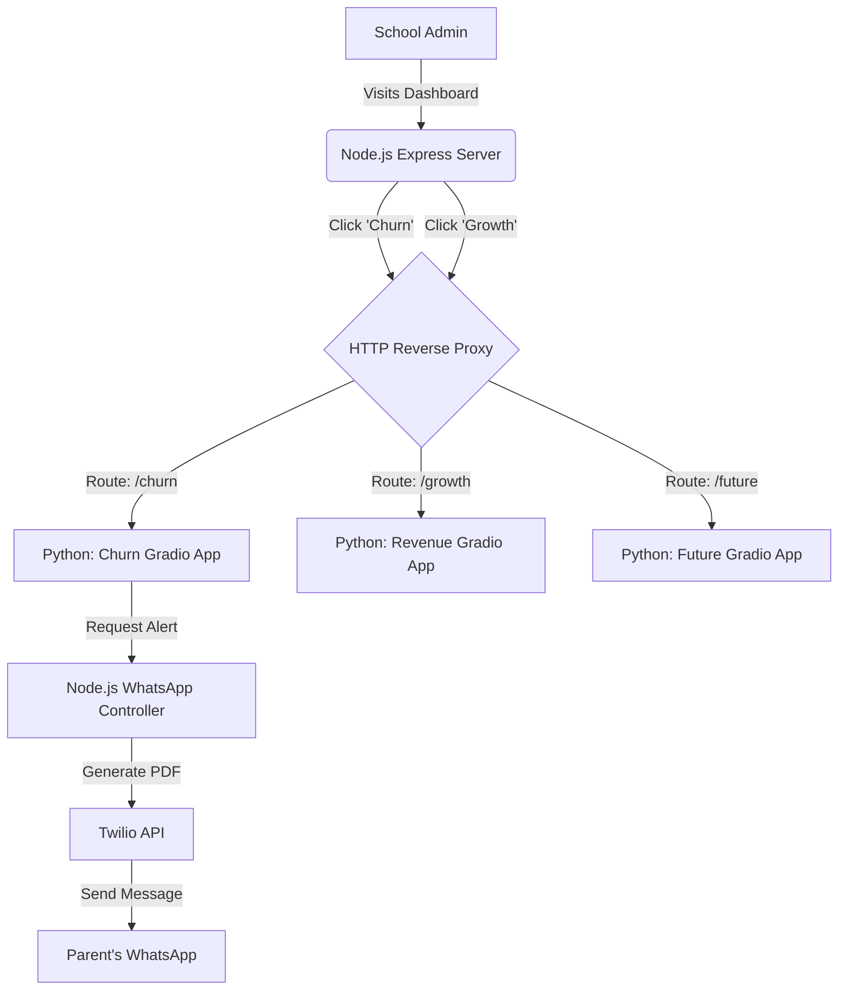

<div align="center">
  <h1>🏫 AI School Intelligence & Growth Analytics</h1>
  <p><b>An enterprise-grade, dual-stack AI platform built to predict student churn, forecast revenue growth, and automate parent interventions via WhatsApp.</b></p>
  
  
</div>

---

## 🚀 Overview

The **AI School Intelligence Platform** is a complete, end-to-end solution for modern educational institutions. It combines a **Node.js** enterprise gateway with a powerful **Python Machine Learning** engine to analyze school data, predict future trends, and automatically take action.

Unlike traditional dashboards, this system doesn't just show you data—it acts on it. When the AI detects a student at high risk of dropping out (churning), the system automatically generates a personalized, branded PDF intervention letter and instantly broadcasts it to their parents via the Twilio WhatsApp API.

---

## ✨ Core Features

### 🧠 1. Predictive Student Churn (Machine Learning)
Upload a spreadsheet of student performance, attendance, and demographics. The **Random Forest Classifier** analyzes the data and flags students who are at high risk of dropping out.
* Generates interactive risk distribution charts.
* Highlights the exact reasons (features) contributing to the churn risk.

### 📈 2. Growth & Revenue Forecasting
Using predictive modeling, the system compares historical multi-year data (e.g., 2024 vs 2025) to forecast 2026 school revenue, admission rates, and infrastructure ROI. 
* Visualizes revenue trajectory and admission growth.
* AI suggests actionable strategies to improve future performance scores.

### 📱 3. Automated WhatsApp Intervention
When at-risk students are identified, the Node.js backend takes over:
* Generates a beautifully formatted, custom PDF letter (complete with the school's geometric branding and logo).
* Uploads the PDF to a secure temporary cloud.
* Uses the **Twilio API** to automatically blast the customized warning letter to the parents' WhatsApp numbers.

---

## ⚙️ System Architecture & Workflow

This project utilizes a highly efficient **Dual-Stack Reverse Proxy Architecture** to run Node.js and Python simultaneously on a single server container (like Render's free tier).



### The Workflow:
1. **Frontend:** The user logs into the sleek HTML/CSS frontend hosted by Node.js.
2. **Proxy:** When the user clicks an AI tool, Node.js silently proxies the traffic to the hidden Python servers running locally on `0.0.0.0`.
3. **ML Processing:** The Python Gradio apps process the datasets using `joblib` pickled models and return the interactive charts back through the Node proxy.
4. **Action:** If the admin clicks "Auto-Send Alerts", the Python app sends a webhook back to the Node.js API, which triggers the PDFKit generation and Twilio blast.

---

## 🛠️ Installation & Local Setup

### Prerequisites
* Python 3.10+
* Node.js v18+

### Quick Start
Because we use `concurrently`, you can launch both the Node.js server and all three Python Machine Learning servers with a single command!

```bash
# 1. Clone the repository
git clone https://github.com/KOTHAVIVEK55/Churn-Prediction-Interention.git
cd Churn-Prediction-Interention

# 2. Install Python Dependencies
pip install -r requirements.txt

# 3. Install Node.js Dependencies
cd backend
npm install

# 4. Start the Entire Platform!
npm start
```
The Node.js server will boot on `http://localhost:3000`. It will automatically launch and proxy the Python apps in the background!

---

## ☁️ 1-Click Cloud Deployment (Render.com)

This project is perfectly optimized for a native, single-container deployment on Render without needing Docker. 

1. Go to **Render.com** -> **New Web Service**.
2. Connect your GitHub repository.
3. Configure the following exact settings:
   * **Environment:** `Node`
   * **Build Command:** `cd backend && npm install && pip install -r ../requirements.txt`
   * **Start Command:** `cd backend && npm start`
4. Add your **Environment Variables**:
   * `TWILIO_ACCOUNT_SID` = Your Twilio SID
   * `TWILIO_AUTH_TOKEN` = Your Twilio Auth Token
   * `TWILIO_PHONE_NUMBER` = Your Twilio Sandbox Number
5. Click **Deploy**.

> **Note:** The initial boot might take up to 60 seconds as the heavy `joblib` machine learning models are loaded into RAM.

---

<div align="center">
  <i>Designed for modern educational administrators to make data-driven decisions and automate student success.</i>
</div>
